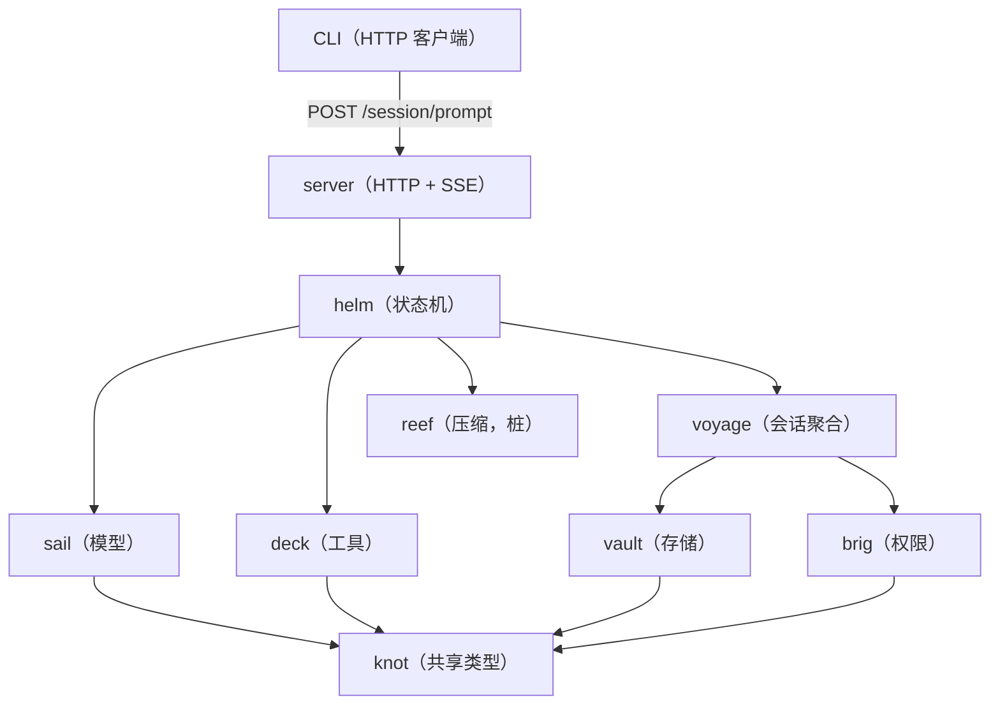

# Argo 技术架构

## 模块清单（9 模块 + knot + server）

| 模块 | 职责 | 状态 |
|------|------|------|
| **knot** | 跨模块共享类型：Message / Event / ToolUse / Config / ToolVerdict | ✅ 稳定 |
| **deck** | 工具注册、发现、调用。内置工具 + CLI 外部工具，统一 Tool 接口 | ✅ 稳定 |
| **sail** | LLM 接入层。Provider 接口（Name/Model/Chat）+ ProviderOpenAI 实现，`NewProvider` 工厂按 `api` 协议路由 | ✅ 稳定 |
| **vault** | 纯存储层。transcript.jsonl 读写 + Message ↔ Record 转换 | ✅ 稳定 |
| **brig** | 权限门控。Gate 接口 + Warden 分层裁决（Iron 红线 → Cord 可配置 → 用户审批 → Ask）+ RuleLoader 规则来源 | ✅ 稳定 |
| **voyage** | 会话运行时聚合体。Voyage = Info + Vault + Gate + Tale + Phase/Model/ToolUses，会话 CRUD + 控制流持久化 | ✅ 稳定 |
| **helm** | Agent 核心循环。状态机四 Phase + PhaseRunner（`Run(ctx, v, emit) bool`）+ checkpoint | ✅ 稳定 |
| **server** | 无状态 HTTP 后端。chi 路由 + SSE 流式事件 | ✅ 稳定 |
| **wake** | 日志模块。日期+大小自动轮转，过期清理 | ✅ 稳定 |
| **reef** | 上下文压缩。当前为桩（`Compact` 原样返回） | 🚧 桩 |
| **crew** | Skill 技能加载。SKILL.md 扫描 + 渐进式披露 | ❌ 未实现 |

## 模块关系



- helm 直接使用 `*voyage.Voyage`，无中间接口
- vault 绑定 session 目录，不知道 session ID
- brig 绑定 WorkingDir，通过 Gate 接口分层裁决
- server 每次请求独立：从磁盘恢复 → Run → 流式转发 → 持久化

## 数据流（一回合）

```
POST /session/prompt
  │
  ▼
handlePrompt
  ├─ 新消息路径：v.Phase = PhaseModel → Tale.AppendUser
  └─ Ask 回复路径：LoadState → 写入 ToolUseVerdicts
  │
  ▼
helm.Run() goroutine 循环：
  │
  ├─ PhaseModel ────────── PhaseRunnerModel
  │   ├─ Tale.BuildRequest(sysPrompt) + sail.Chat（SSE 流式消费）
  │   ├─ 无工具调用 → Tale.AppendAssistant + Phase = Done
  │   └─ 有工具调用 → Tale.AppendAssistant + Phase = ExecTools
  │
  ├─ PhaseExecTools ───── PhaseRunnerExecTools
  │   ├─ Evaluate → Allow/Deny/Ask
  │   ├─ Allow → tool.Execute → Tale.AppendTool
  │   ├─ Ask → Phase = Asking（return false；run.go 调 Asking runner 后退出）
  │   └─ 全部完成 → Phase = Model（循环）
  │
  ├─ PhaseAsking ──────── PhaseRunnerAsking（return true）
  │   └─ checkpoint + SaveState → goroutine 退出
  │
  └─ PhaseDone ────────── PhaseRunnerDone（return true）
      └─ checkpoint → goroutine 退出
```

所有事件通过 `<-chan knot.Event` 流式发出，server 以 SSE 格式转发给 CLI。

## 会话目录结构

```
~/.argo/sessions/{sessionID}/
  ├── session.json        ← Info 元数据（voyage 管理）
  ├── transcript.jsonl    ← 对话记录（vault 管理）
  ├── approvals.json      ← 用户审批记录（brig 管理）
  └── state.json          ← 控制流状态（voyage 管理）
```

## 代码目录

```
src/
├── knot/           共享类型（Message / Event / ToolUse / Config）
├── deck/           工具管理（Tool 接口 + 注册表 + 内置工具）
├── sail/           LLM 接入（Provider 接口 + ProviderOpenAI）
├── vault/          纯存储（Vault 接口 + FileVault + Record）
├── brig/           权限门控（Gate 接口 + Warden + RuleLoader）
├── voyage/         会话运行时聚合体（Voyage + Info + CRUD）
├── helm/           核心循环（状态机 + PhaseRunner + checkpoint）
├── reef/           上下文压缩（桩）
├── wake/           日志轮转（LogWriter）
├── tale/           对话历史封装（Tale：Messages + Saved 游标）
├── server/         无状态 HTTP 后端（chi + SSE）
├── cli/            CLI HTTP 客户端
└── argo-server/    HTTP 服务入口 main
```
