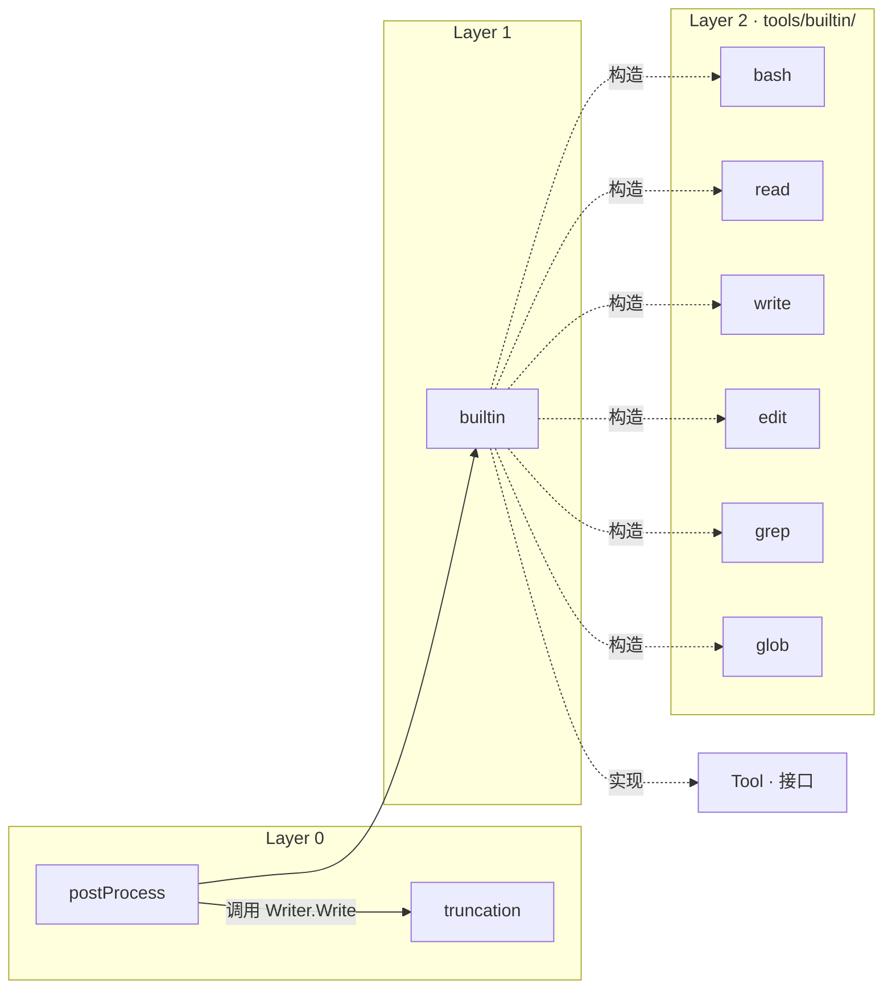
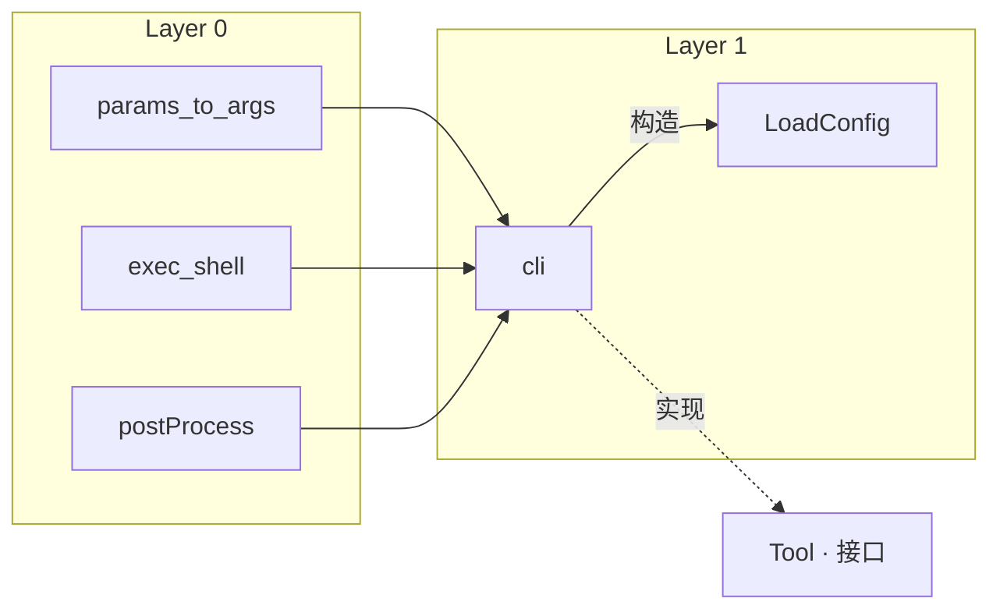
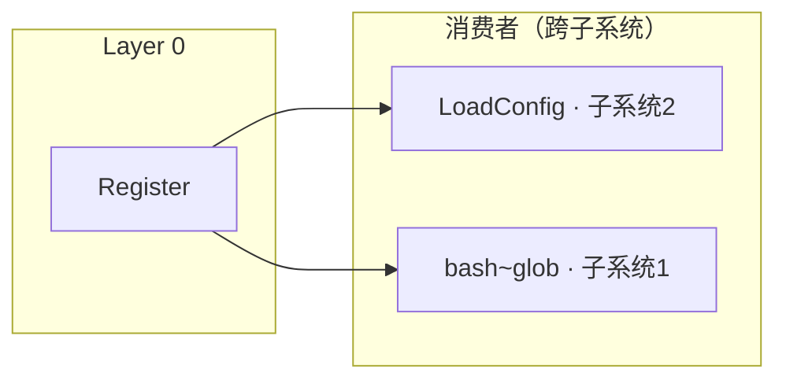
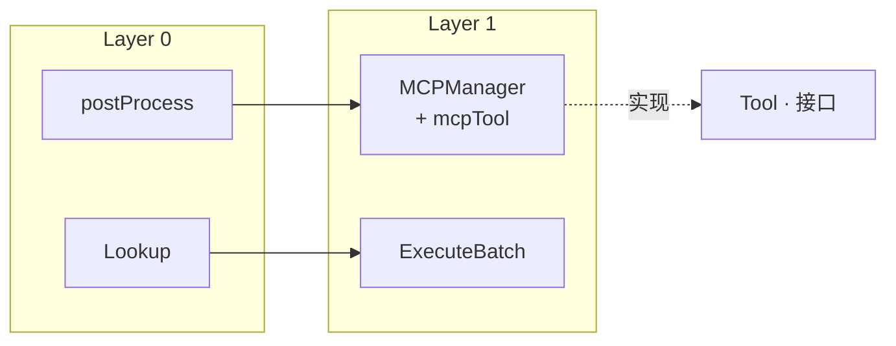

# deck 模块依赖树

> 由 chart 生成，作为 gen-test、gen-code、调度主 agent 的唯一权威参考。
> 手动编辑此文件可调整计划。

## 接口清单

| 接口 | 方法 | 实现者 | task 文件 |
|------|------|--------|-----------|
| `Tool` | Name(), Description(), Source(), Execute(ctx, params), Concurrency() | builtinTool, cliTool, mcpTool | [Tool.md](Tool.md) |

## 基础类型与常量

以下由调度器直接生成 Go 代码，不分配 task：

`ToolSource` · `ConcurrencyMode` · `ToolResult` · `ToolCall` · `ToolsConfig` · `CLIToolEntry` · `MCPToolEntry` · `builtinTool` struct · `cliTool` struct · `mcpTool` struct · `NewBuiltinTool` · unexported `tools` map

> 注：`TruncationStrategy` / `TruncationConfig` / `TruncationConfigJSON` 不再由调度器直接生成，已移交给 [postProcess.md](postProcess.md) task 内新增（详见 postProcess.md「依赖详情 → 本 task 内新增」）。

## 依赖关系图

> 箭头方向：A → B 表示 A 依赖 B（B 必须先就绪）
> 实线 = 函数调用 · 虚线 = 实现接口 / 类型引用

### 子系统 1：builtin 工具链

覆盖 9 个 task：truncation → postProcess → builtin → 六个内置工具。Register 已单独在子系统 3 中。

### 子系统 2：CLI + 配置加载

覆盖 5 个 task：params_to_args / exec_shell / postProcess → cli → LoadConfig。

### 子系统 3：注册系统

覆盖 2 个 task：Register 被 Layer 1（LoadConfig）和 Layer 2（六个 builtin 工具）共同依赖。跨子系统引用见子系统 1、2。

### 子系统 4：MCP + 批量执行

覆盖 3 个 task：postProcess → MCPManager+mcpTool。LoadConfig 见子系统 2。ExecuteBatch 依赖 Lookup。

### 未列入子系统的独立节点

`List` 是纯查询函数，无上层消费者，独立开发不受限。

## 进度

> **状态图例**：⬜ pending_test → 🔴 testing → 🟡 test_ready → 🟢 coding → ✅ code_done · ❌ report_generated

| 阶段 | 前置 | # | Task | 状态 |
|------|------|---|------|------|
| ① 接口 | 无 | 1 | Tool | ✅ code_done |
| ② Layer 0 | ① | 1 | truncation | ✅ code_done |
| ② | | 2 | postProcess | 🟡 test_ready |
| ② | | 3 | exec_shell | ✅ code_done |
| ② | | 4 | params_to_args | ✅ code_done |
| ② | | 5 | Register | ✅ code_done |
| ② | | 6 | List | ✅ code_done |
| ② | | 7 | Lookup | ✅ code_done |
| ③ Layer 1 | ② | 1 | builtin | ⬜ pending_test |
| ③ | | 2 | cli | ⬜ pending_test |
| ③ | | 3 | MCPManager+mcpTool | ⬜ pending_test |
| ③ | | 4 | ExecuteBatch | ⬜ pending_test |
| ③ | | 5 | LoadConfig | ⬜ pending_test |
| ④ Layer 2 | ③ | 1 | bash | ⬜ pending_test |
| ④ | | 2 | read | ⬜ pending_test |
| ④ | | 3 | write | ⬜ pending_test |
| ④ | | 4 | edit | ⬜ pending_test |
| ④ | | 5 | grep | ⬜ pending_test |
| ④ | | 6 | glob | ⬜ pending_test |

**合计：1/18 接口 · 6/17 函数**

| 层 | 完成/总数 |
|----|----------|
| 接口 | 1/1 ✅ |
| Layer 0 | 6/7 |
| Layer 1 | 0/5 |
| Layer 2 | 0/6 |

## 设计决策

1. **MCPManager + mcpTool 合并**：两者互相引用，拆分导致循环依赖。
2. **Register/List/Lookup 独立**：共享 `tools` map 但不互调，可并行。
3. **六个内置工具放在 Layer 2**：通过 init() 调用 deck.Register，依赖 Register（L0）和 builtin 类型（L1）。
4. **List 无消费者**：仅被 helm 直接调用（模块外部），deck 内部无人依赖，开发时机自由。
5. **postProcess 接收 TruncationConfig**：每个工具自带截断策略（head/tail/HeadAndTail）+ 可配置百分点比例（int 1~80，详见 [DEC-010](../../deck/decisions.md#dec-010truncationconfig-ratiotailratio-改-int-百分点)），详见 [DEC-007](../../deck/decisions.md#dec-007工具结果后处理方案重写supersedes-原-dec-007-和-dec-009)。
6. **truncation 目录管理独立为 Layer 0 task**（详见 [DEC-012](../../deck/decisions.md#dec-012truncation-目录管理归属)）：postProcess 通过 `truncation.Writer` 接口调用，IO 失败降级到无 path marker 模式。复用 DEC-007 路径约定（`~/.argo/truncation/tool-<unix-nano>-<random>.log`，retention 7 天）。
6. **LoadFromConfig → LoadConfig**：函数重命名，语义更简洁。
