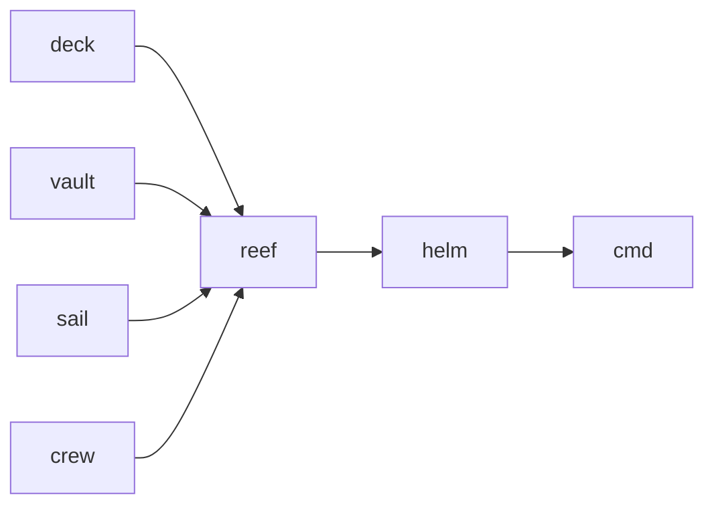
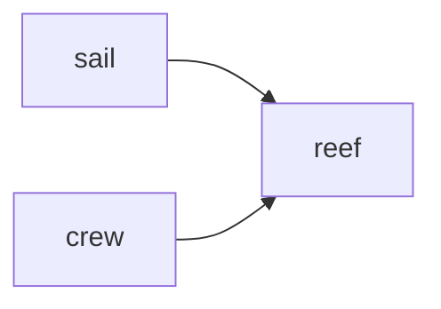
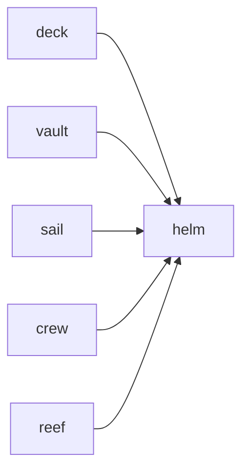
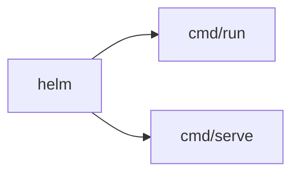

# Argo 开发路线

## 阶段 1：基础模块 — deck, vault, sail, crew ▶

搭建四个零外部依赖的底层模块，为上层模块（reef、helm）提供工具、存储、模型、技能四个维度的能力基座。四个模块互不依赖，可并行开发。

### 模块依赖

### 模块目标

- [x] deck — 工具管理模块：工具的注册、发现、调用，统一内置工具与 CLI 外部工具
- [ ] vault — FileVault 默认文件系统实现、transcript.jsonl 追加写入（6 种 type）、profile.md 读写与预算控制 / AGENTS.md 只读加载
- [x] sail — 桩阶段完成：Chat() / Window() / DefaultModel() + config.json 三层 provider 配置解析
- [ ] sail — 后续：anthropic / openai / openai-compatible adapter + 错误分类
- [ ] crew — SKILL.md 文件扫描、YAML frontmatter 解析、List / Instructions 渐进式披露接口

## 阶段 2：上下文压缩 — reef

依赖 sail（LLM 调用生成摘要）和 crew（加载压缩模板 SKILL.md），实现会话消息历史的自动裁剪与摘要压缩，防止 context window 溢出。

### 模块依赖

### 模块目标

- [x] reef — Compact() 桩（原样返回）
- [ ] reef — 后续：shouldCompact 触发判定（80% 阈值）、findCutPoint 切割算法、LLM 摘要生成与错误降级、消息重组

## 阶段 3：核心循环 — helm

依赖全部五个底层模块（deck / vault / sail / crew / reef），实现 Agent 主循环：用户输入 → LLM 调用 → 工具执行 → 结果返回 → 循环。通过 channel 流式推送事件，调用方持有会话状态。

### 模块依赖

### 模块目标

- [x] helm — RunLoop() 五步闭环（Compact → Chat → 消费 → 执行 → 注入），12 种流式事件，五步桩阶段闭环

## 阶段 4：双入口与集成 — cmd

依赖 helm 及全部底层模块，提供 CLI 和 Gateway 两种运行形态入口，完成端到端集成。

### 模块依赖

### 模块目标

- [ ] cmd/run — CLI 交互式入口（stdin 输入 / stdout 流式输出）
- [ ] cmd/serve — Gateway RPC 服务端入口（常驻进程，客户端远程连接）
