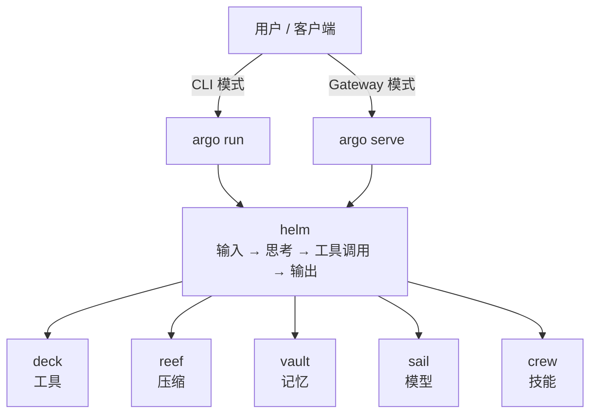

# Argo 功能模块总览

## 概述

本文档定义 Argo 的六个核心模块及其协作关系。Argo 整体是一个极简 AI Agent 运行基座，六个模块各自独立、通过明确接口契约协作，任一模块可替换实现而不影响其余模块。

## 模块清单

### deck — 工具管理

- **职责**：工具的注册、发现、描述和调用。统一 CLI 本地工具和 MCP 协议工具的接入面，对上屏蔽不同工具来源的调用差异
- **消费**：无（最底层模块，不依赖其他 Argo 模块）
- **产出**：包级函数 List / Lookup / ExecuteBatch，供 helm 查询可用工具列表和发起工具调用

### helm — 核心 Agent 循环

- **职责**：执行 "用户输入 → 模型调用 → 工具执行 → 结果返回 → 循环" 的 Agent 主循环。管理单次会话的上下文窗口、工具调用决策和 Skill 行为约束的执行
- **消费**：deck 的工具注册表、reef 的消息裁剪、vault 的长期记忆检索、sail 的模型实例、crew 的 Skill 定义
- **产出**：会话状态（SessionState），包含消息历史、工具调用记录、当前上下文

### reef — 会话上下文压缩

- **职责**：当会话消息历史的 token 数接近 context window 上限时，裁剪或摘要旧消息，防止 API 拒绝请求（413 prompt too long）。只管理会话内的上下文长度，不涉及跨会话的记忆存储
- **消费**：无（独立压缩模块）
- **产出**：消息裁剪/摘要接口，供 helm 在每轮 LLM 调用前执行

### vault — 长期记忆管理

- **职责**：会话对话记录（transcript）的持久化、会话间长期记忆的存储与检索。统一管理所有持久化数据
- **消费**：无（独立存储模块）
- **产出**：数据存取接口，供 helm 写入对话记录、加载长期记忆，供 reef/LLM 回溯原文

### sail — API 管理

- **职责**：多模型 API 的配置存储、API Key 安全管理、模型实例的统一创建和调用路由。屏蔽不同模型供应商的 API 差异
- **消费**：无（独立配置模块）
- **产出**：LLM 调用接口，供 helm 获取可调用的模型客户端

### crew — Skill 库

- **职责**：Skill（Markdown 流程定义文件）的加载、校验和执行调度。Skill 定义了 Agent 在特定场景下的行为约束和交互流程
- **消费**：无（Skill 内容由上层应用提供）
- **产出**：Skill 注册表（SkillRegistry），供 helm 查询当前可用的 Skill 及其行为约束

## 模块间契约

### Tool 协议

- 由 deck 定义，helm 消费
- 每个工具 MUST 提供：名称、描述（自然语言，LLM 可读）、参数 schema（JSON Schema 格式）
- 工具来源分为两类：CLI 本地工具（通过 exec 调用）和 MCP 协议工具（通过 MCP client 调用），deck 对上屏蔽来源差异
- 工具调用为同步阻塞模式，调用结果以字符串形式返回给 helm 注入上下文

### Compact 协议

- 由 reef 定义，helm 消费
- 接口：`Compact(messages []Message, window TokenLimit) ([]Message, error)`
- 输入：当前消息历史 + 模型的 context window 上限
- 输出：裁剪后的消息历史（保留 system prompt + 最近 N 轮，最早的消息被截断或摘要替换）
- reef 的具体压缩策略（截断 / 摘要 / 折叠）是内部实现，helm 不感知

### Memory 协议

- 由 vault 定义，helm 消费
- 存储接口：`Store(key string, value string, metadata map[string]any) error`
- 检索接口：`Retrieve(query string, limit int) ([]MemoryEntry, error)`
- MemoryEntry SHALL 包含：内容、创建时间戳、最后访问时间戳、重要性权重、来源会话 ID
- vault 不规定底层存储引擎（可以是文件、SQLite、向量数据库），只规定接口

### Model 协议

- 由 sail 定义，helm 消费
- 统一调用接口：`Chat(messages []Message, tools []Tool, options ChatOptions) (*ChatResponse, error)`
- ChatOptions SHALL 支持：model 选择、temperature、max_tokens
- ChatResponse SHALL 包含：文本回复、工具调用请求列表（如有）、token 用量
- sail 屏蔽 OpenAI / Anthropic / DeepSeek 等不同 API 的差异，对 helm 暴露一致的调用面

### Skill 协议

- 由 crew 定义，helm 消费
- Skill MUST 为 Markdown 文件，包含以下字段：触发条件（when to activate）、行为约束（what the agent SHALL/SHALL NOT do）、退出标准（when to end）
- helm 在会话初始化时加载指定 Skill，将其行为约束注入 system prompt
- Skill 之间互斥：同一会话 SHALL 只激活一个 Skill

## 模块关系图


数据流（箭头方向 = 数据消费方向）：

- helm ← deck：查询可用工具列表 → 发起工具调用 → 接收调用结果
- helm ← reef：每轮 LLM 调用前，裁剪消息历史以防 context window 溢出
- helm ← vault：会话开始时检索长期记忆 + 每轮结束后写入对话记录
- helm ← sail：获取模型实例 → 发送 Chat 请求 → 接收模型响应
- helm ← crew：会话开始时加载 Skill → 注入 system prompt

## 产品形态

Argo 以同一份核心代码编译为两种运行模式，通过子命令切换。

### CLI 模式

```
argo run --skill learn
```

- 终端中的交互式 Agent 会话
- 用户输入通过 stdin，Agent 输出通过 stdout
- deck 的工具调用在本地进程内完成
- 适用于 Vug 等需要在终端中直接使用的场景

### Gateway 模式

```
argo serve --port 9090
```

- 作为 RPC 服务端常驻后台
- 客户端通过 RPC 协议发送消息、接收响应
- deck 的工具调用在服务端进程内完成
- 适用于叩问等需要远程调用 Agent 的场景（如微信小程序后端 → Argo 服务端）
